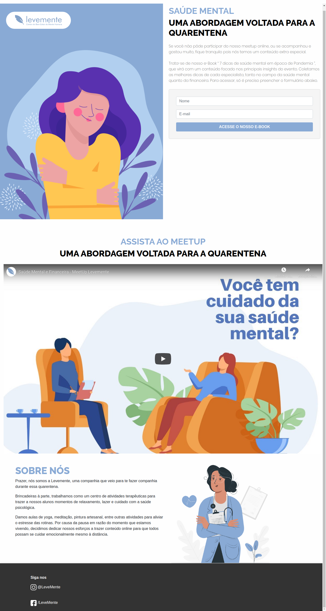

<h1 align="center">
  
</h1>  


## 📝 Sobre este projeto

A ideia da landing page é:

_" É uma página criada para capturar contatos e avisar via email sobre a live com tema sobre: Saúde Mental na Pandemia"._

--- 

## 🧩 Funcionalidades
1. Ela tem funcionalidade de envio de nome e email a partir do formulário embedado na página através do mailchimp.
2. Na página contém vídeo da Live para acompanhar. 

---

## 📁 Como baixar o projeto

````
# Clonar o repositório
$ git clone https://github.com/grupo-levemente/levemente

# Entrar no diretório
$ cd levemente

````
---

## 🚀 Construído com

- [HTML](https://www.w3schools.com/html/)
- [CSS](https://www.w3schools.com/css/)
- [BOOSTRAP v4](https://getbootstrap.com/docs/4.5/getting-started/introduction/)
- [JQUERY](https://www.w3schools.com/jquery/)
- [JAVASCRIPT](https://www.w3schools.com/js/)

---

## ⚙️ Ferramentas de suporte

- [Mailchimp] (https://mailchimp.com/) - Para criação do formulário, gestão de contados e disparos de emails
- [Netlify] (https://www.netlify.com/) - Serviço de hospedagem da página

